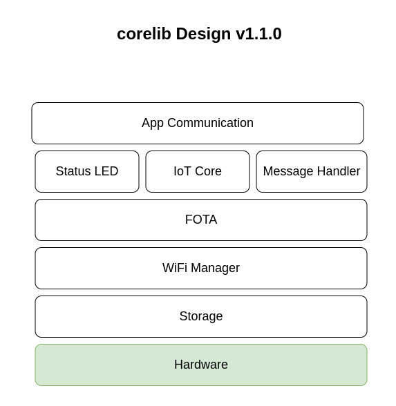

# corelib

Install each dependencies globally before proceeding.

```console
$ pio lib install 256dpi/MQTT@2.4.8
```

## Design



## Note
  - There is one problem which prevents compilation from happening. It says that **ESP8266HTTPClient.h**. One way to fix this problem is by including the header file in main project source file. For eg. Let's say FOTA.h includes ESP8266HTTPClient.h file. To fix this issue, in the project's main file (main.cpp) write `#include <FOTA.h>`. This somehow magically fixes the problem. Still don't know why this problem crops up.

  - Many a times project will not compile, during that time. Delete the `.pio/` folder and rebuild the project.
